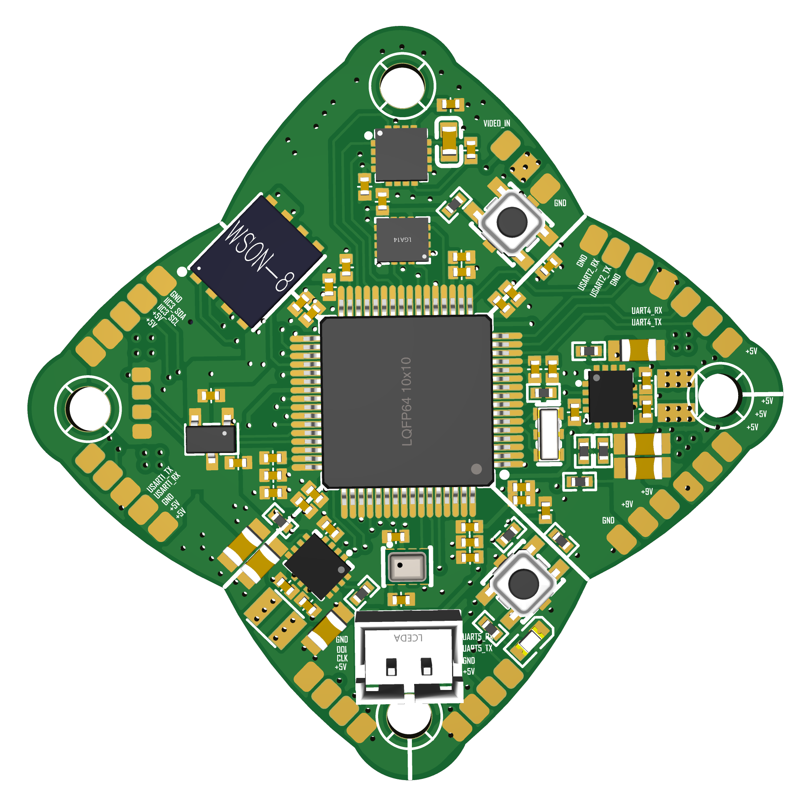

PCB图：

## 2025-11-11：项目初始化

**主要内容：**

- 提交了完整的 STM32F405 飞控项目框架，包括启动代码、HAL 驱动、配置文件等。
- 核心目录包括：`Core/`（应用代码）、`Drivers/`（HAL 库）、`.mxproject` 文件（STM32CubeMX 工程配置）等。
- 实现了最基础的系统启动、GPIO/UART 初始化逻辑。

## 2025-11-12：BMP280 气压计驱动（未测试）

**主要内容：**

- 新增 `Core/Lib/bmp280/` 文件夹，添加 `bmp280.c/.h` 和 `bmp280_lib.c/.h` 驱动代码。
- 配置构建系统，纳入气压计库文件。
- 实现了基本的温度/气压读取函数，但未进行硬件验证。

## 2025-11-13：新增 PID 控制器与姿态解算模块（未测试）

**主要内容：**

- `Core/Control/PID/` 添加了 `pid.c/.h` 实现 PID 控制器基础逻辑。
- `Core/Control/Attitude Control/` 新增 `attitude.c/.h` 用于姿态解算（初步实现角度计算框架）。
- 开始接入 ELRS 接收机：新建 `Core/Lib/elrs/` 包含 `elrs_crsf_uart.c/h` 与协议解析代码（通过 UART 接收遥控信号）。

## 2025-11-21：传感器测试（ICM42688P、BMP280）

**主要内容：**

- 新增多个测试模块：`test_icm42688p.c/h`, `test_bmp280.c/h`, `test_dma.c/h` 等。
- 测试 IMU（陀螺仪/加速度计）与气压计的数据读取功能，验证传感器能正常工作。
- 开始优化 SPI 通讯逻辑，~~加入 DMA 支持~~，添加错误捕捉输出（如 SPI 失败提示）。

## 2025-11-22：接入 HMC5883L 磁力计 + 初始 HTML 页面

**主要内容：**

- 在 `Core/Lib/hmc5883l/` 添加磁力计驱动，支持 I2C2 通讯总线。
- 姿态模块中新增基于磁力计初始化方向的函数（用于修正航向角）。
- `html/index.html` 初步上线，为后续 Web UI 界面打下基础。

## 2025-11-23：HTML 前端结构解耦，添加 JS 与 CSS 模块

**主要内容：**

- 将原有 HTML 页面内嵌样式和脚本抽离，新增 `js/` 与 `styles/` 目录。
- 脚本功能包括：串口通讯（serial.js）、姿态绘制（orientation.js）、UI 控制（ui.js）等。
- 新增 IMU 测试模块 `test_imu.c/h`。

## 2025-11-24：引入任务调度系统

**主要内容：**

- 新增 `task_scheduler.c/h`, `task_register.c/h` 实现任务调度框架。
- 将传感器读取、滤波、姿态解算、控制输出等拆分为独立任务，按周期调度运行。
- 重构了姿态任务与滤波逻辑，提升代码模块化和可维护性。
- 但是并没有开始使用。

## 2025-11-26：姿态解算完美解决 + Debug 清理

**主要内容：**

- Mahony 滤波器增益优化（Kp/Ki 调整），加入磁力计辅助，解算更稳定。
- 新增 `Attitude_InitFromAccelMag` 用于通过加速度计+磁力计初始化角度。
- 明确取消在实时解算中进行陀螺仪/磁力计自动校准，转由独立校准流程负责。

## 2025-11-27：引入 VL53L0X 距离传感器（ToF）

**主要内容：**

- 添加官方 VL53L0X 驱动库（约 1.2 万行），通过 I2C2 读取距离信息。
- 但未进行验证。
- 优化磁力计校准逻辑，改为手动触发，避免飞行中不稳定因素。

## 2025-11-28：Web UI 全面更新

**主要内容：**

- 大量美化 `index.html`，引入模块化结构与控制面板布局。
- 更新 CSS 和 JS，实现实时数据显示、传感器状态图标、校准引导流程。
- 打通数据通道：飞控 → 串口 → Web Serial → 实时 UI 展示。

## 2025-11-29：姿态球上线 + UI 模块结构优化

**主要内容：**

- 在 `orientation.js` + `scene.js` 中绘制 3D 姿态球（Canvas 或 WebGL）。
- 页面加入 `<canvas>` 区域实时显示飞控姿态（俯仰/横滚/航向）。
- JavaScript 完善事件驱动机制，不同模块间解耦，代码更清晰可维护。

## 2025-11-30：最后调试与完善

**主要内容：**

- PID 输出对接 mixer（混控），实现姿态控制 → 电机控制完整闭环。
- 调整 PWM 输出，确保电调接收正确信号（初步实现电机测试）。
- 完成大部分功能逻辑，提交“基本完善”、“完全 OK”的标志性 commit。

## 2025-12-01：集成 PWM 输出与混控

**主要内容：**

- 添加 `mixer.c/.h` 计算各电机输出值（四轴姿态混控）。
- 配置 TIM 定时器输出 PWM，占空比按姿态控制结果动态计算。
- 系统已完成传感器融合、姿态 PID、输出控制的完整闭环。
- 未进行测试。

## 2025-12-02：添加加载页 + 准备 PCB 设计

**主要内容：**

- 添加 `load 页面` 显示加载状态，优化首次加载体验。
- 继续修改 UI 样式，改名澪。
- UI开发告一段落，开始着手 PCB 硬件设计。

## 2025-12-08：开始 PCB 设计

**主要内容：**

- 12.08开始设计原理图，最开始打算加上接收机，后面觉得算了。

## 2025-12-10：PCB 完成